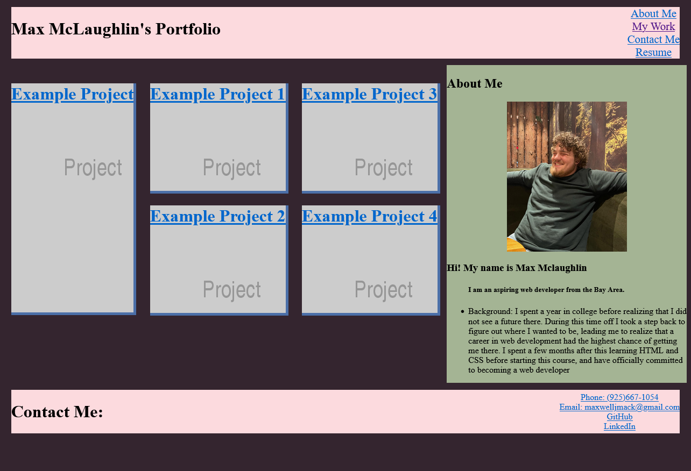

# Module 2 Challenge

## Table of Contents

- [Overview](#overview)
  - [The challenge](#the-challenge)
  - [User Story](#user-story)
  - [Acceptance Criteria](#acceptance-criteria)
  - [Screenshot](#screenshot)
  - [Links](#links)
- [My process](#my-process)
  - [Built with](#built-with)
  - [What I learned](#what-i-learned)
  - [Continued development](#continued-development)
  - [Useful resources](#useful-resources)
- [Author](#author)
- [Acknowledgments](#acknowledgments)
  ​

## Overview

This weeks challenge was to create a portfolio from scratch using HTML and CSS
​

### The challenge

​Create a personal portfolio from scratch using HTML and CSS.

### User Story

```
AS AN employer
I WANT to view a potential employee's deployed portfolio of work samples
SO THAT I can review samples of their work and assess whether they're a good candidate for an open position
```

### Acceptance Criteria

​

```
GIVEN I need to sample a potential employee's previous work
WHEN I load their portfolio
THEN I am presented with the developer's name, a recent photo or avatar, and links to sections about them, their work, and how to contact them
WHEN I click one of the links in the navigation
THEN the UI scrolls to the corresponding section
WHEN I click on the link to the section about their work
THEN the UI scrolls to a section with titled images of the developer's applications
WHEN I am presented with the developer's first application
THEN that application's image should be larger in size than the others
WHEN I click on the images of the applications
THEN I am taken to that deployed application
WHEN I resize the page or view the site on various screens and devices
THEN I am presented with a responsive layout that adapts to my viewport
```

​

### Screenshot

​


### Links

​

- Solution URL: [Solution](https://github.com/lafflin/homework-2)
- Live Site URL: [Site](https://lafflin.github.io/homework-2/)
  ​

## My process

​

1. I first started with making a wireframe to get an idea of how I wanted the site to look.
2. After this the first thing I did (and the thing that took me the longest) was creating the layout and flex box areas, making sure that everything functioned how I wanted it too
3. I followed this by adding all the content to the page, such as the nav bar (and links), the about me section, the footer, and the placeholder images for the projects. I also added a work-in-progress resume for the sake of having one linked to the page.
4. After this I worked on getting things to work properly again, added the media queries and got my buttons to be spaced out properly.

### Built with

- HTML
- CSS

### What I learned

- I learned a lot about flexbox. Most of the issues I hit were to do with flexbox, which helped me to get better at googling specific issues to find solutions to problems I was running into
- I learned to organize my code a bit better, as well as leaving myself comments so that I can tell where I was confused when I last left off for when I come back to it.
- I got a lot better at using dev tools in the browser.

### Continued development

- The number one thing I need to work on more would still be CSS. It is still difficult for me to visualize what will happen when I write the code, but got better with this project. As for how to improve I think I simply need to do more work still.

### Useful resources

- [For Flexbox](https://css-tricks.com/snippets/css/a-guide-to-flexbox/) - This was a huge help as it has the flexbox properties with small images of how each effects the content.
- [For color palette](https://coolors.co/) - Simple tool that allowed me to more easily get a color palette, although the more I worked on the site the less I liked the palette I chose.

## Author

- Linkedin - [Max McLaughlin](https://www.linkedin.com/in/max-mcla/)

## Acknowledgments

- The class in general, for everyone being open and supportive anytime anyone requests help.
- Sachin Jhaveri, my tutor, for helping me to get the project started right and assisting me with flexbox.
